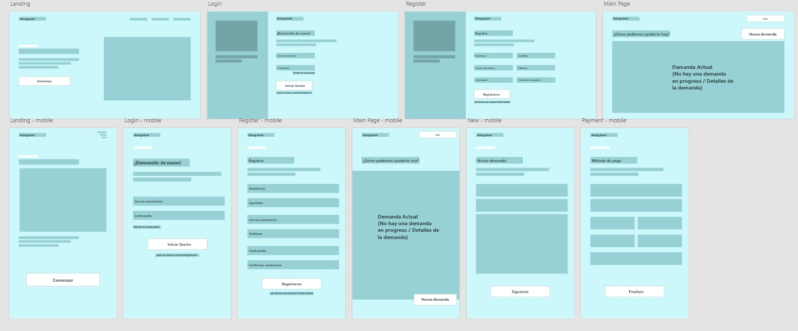
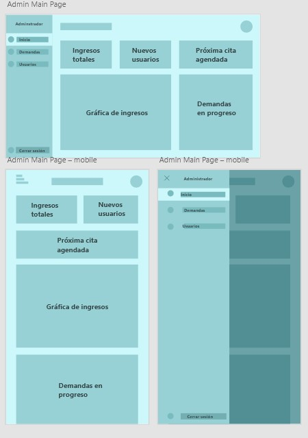
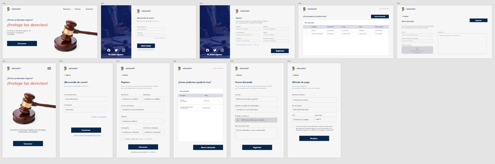
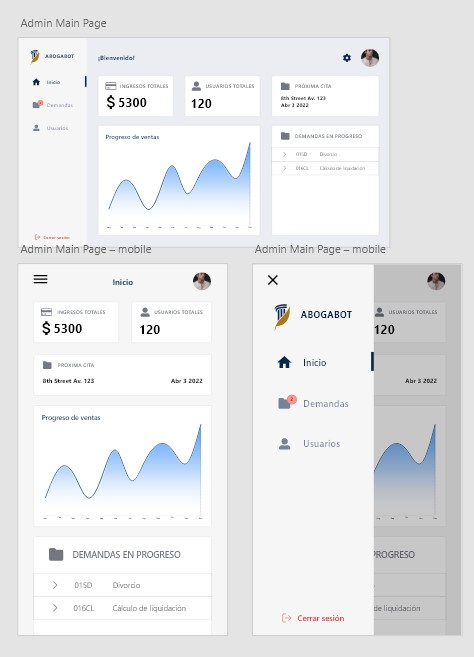

# LaunchX - FrontEnd-Mission - Intro

## Caso: Abogabot

Descripción: 
- Es un despacho de abogados que quiere automatizar las demandas de sus clientes, esto lo harán a traves de una página web llenando un formulario.
- Al momento de llenar el formulario se manda al proceso de pago para finalizar la transacción.
- Para dar seguimiento a su demanda, el cliente crea una cuenta en la plataforma y verá el seguimiento de cada una de las actualizaciones del proceso legal.
- El administrador del sitio recibe la notificación de una nueva demanda y con los datos llenados del formulario se crea automaticamente el documento  legal en formato word para empezar el proceso.
- El administrador recibe el pago y debe de ser capaz de verlo en un dashboard para ver la cantidad de ingresos recibidos.
- El administrador actualiza el proceso de la demanda y agrega comentarios en cada paso del proceso.
- Al usuario le llegan correos de notificación para saber el avance de su proceso.
- La página debe de ser responsive para poderla ver desde el celular.
- La preferencia de colores del cliente es azul marino y blanco, pero acepta propuestas.

## Requerimientos
1. Dar usuarios de alta/baja (demandantes) con correo y contraseña
2. Captura de datos de la demanda, así como la carga de archivos y 
documentos que apoyen la demanda (pruebas y evidencias)
3. Inclusión de un sistema de pagos
4. Dar seguimiento a las demandas
5. Notificar al demandante de los cambios en las demandas
6. Inclusión de dashboard con las ganancias obtenidas en tiempo real
7. Crear documentos legales en formato Word basado en la entrada de datos 
del demandante
8. Almacenamiento de las demandas y de su estatus actual
9. Diseño Responsive para dispositivos móviles y tabletas
10. Disponibilidad en todo momento
11. Accesibilidad para usuarios daltónicos
12. Incluir datos de contacto de la empresa
13. Incluir preferencia de colores de la empresa

## Buyer Persona
Andrea Demandante, es una empleada de 36 años, que ha terminado su maestría, actualmente trabaja
en una organización de entre 50 a 200 empleados, y su principal responsabilidad laboral es la gestión
del personal, tiene mucho involucramiento con las personas,
este trabajo le consume mucho tiempo.
Muchas veces se siente atada o imposibilitada ante ciertas situaciones, pues le gusta hacer
las cosas de la manera correcta, y a menudo se lo impiden.

## Público objetivo
- Hombres y mujeres de entre 35 y 44 años
- Licenciatura o maestría como mayor nivel de estudios realizados
- Nivel socioeconómico medio
- Residan en zonas urbanas

## Wireframes

## Diseño UI

